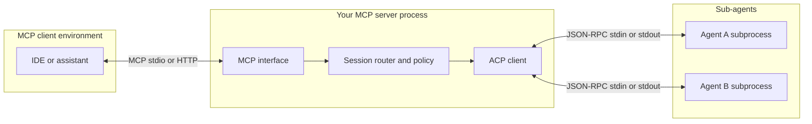

# Plan: MCP Server Using ACP to Orchestrate Sub-Agents

## Purpose and audience

This document is an implementation plan for building an MCP (Model Context Protocol) server whose tools and workflows delegate work to one or more ACP (Agent Client Protocol) agents running as sub-processes. It is grounded in the public ACP architecture description and related protocol material cited in References.

## Source context from ACP architecture

The Agent Client Protocol standardizes how AI agents and client applications talk to each other. The published architecture emphasizes the following points that matter directly to this plan.

#### Transport

Agents are typically spawned on demand; the editor (or any compliant client) talks to the agent over stdin and stdout using JSON-RPC.

#### Sessions

A single ACP connection can host several concurrent sessions, so one orchestrator can run parallel “trains of thought” without extra TCP ports.

#### Streaming and bidirectionality

ACP uses JSON-RPC notifications for streaming UI-oriented updates, and JSON-RPC requests in both directions (for example, the agent can ask the client to approve a tool call).

#### MCP relationship

ACP is intentionally MCP-friendly: JSON-RPC based, and it reuses MCP types where practical so integrators avoid parallel type systems. In the common setup, the client forwards MCP server configuration to the agent so the agent can attach to those MCP servers directly.

#### Editor-hosted MCP

When the editor wants to expose MCP tools without colliding transports, it can supply a small proxy that tunnels MCP back over the existing relationship to the editor. Your design can mirror that “tunnel and multiplex” idea at your own boundary.

For the full documentation index used when exploring ACP, see https://agentclientprotocol.com/llms.txt (recommended entry point for additional pages).

## Problem statement

You want a single MCP surface (tools, resources, prompts as appropriate) that upstream clients already understand, while the heavy or specialized reasoning runs in isolated ACP agent processes with their own sessions, streaming, and permission flows.

That implies three distinct roles:

1. MCP host process: speaks MCP to Cursor, Claude Desktop, or another MCP-capable client.

2. ACP client logic: implements enough of the client side of ACP to spawn agents, open sessions, send prompts, and consume notifications.

3. Sub-agents: ACP-speaking agent binaries (or libraries) you do not necessarily own, configured per task or per specialization.

## Architectural options

### Option A: MCP server as ACP client (recommended baseline)

The MCP server process embeds or links an ACP client. MCP tool invocations map to ACP operations such as `session/new`, `session/prompt`, and subscription to `session/update` notifications. Each logical sub-agent is an OS subprocess with its own stdin or stdout JSON-RPC link to your embedded client.

Strengths:

- Clear trust boundary: MCP callers see only your curated tools.

- Reuses the documented “boot agent on demand” model.

- Sub-agents remain standard ACP agents, swappable from the registry or your own builds.

Tradeoffs:

- You must implement or adopt an ACP client stack (see References for language SDKs).

- You are responsible for subprocess lifecycle, backpressure, and correlating MCP tool calls with ACP session traffic.

### Option B: MCP-over-ACP as the integration seam (future-facing)

The MCP-over-ACP proposal adds an `"acp"` MCP transport so MCP tool traffic can ride the existing ACP channel instead of separate stdio or HTTP servers. That pattern fits when your component already sits in the ACP graph (for example, as a client injecting tools into a session) and wants callbacks without extra processes.

Strengths:

- Avoids extra MCP listener ports when the surrounding product is already ACP-native.

- Aligns with ecosystem direction for sandboxed or remote components.

Tradeoffs:

- Requires the agent to advertise `mcpCapabilities.acp` or a bridge that translates ACP-transport MCP to stdio or HTTP for older agents.

- Less natural if your only public API today is “be an MCP server for Cursor,” not “participate inside an ACP editor session.”

For many “MCP server that fans out to agents” products, Option A is the pragmatic first milestone; Option B becomes relevant when you ship inside an ACP client or conductor-style proxy.

## Target end state (Option A)

Behavioral contract:

- The MCP layer exposes a small, stable set of tools (for example: `delegate_task`, `list_sessions`, `cancel_session`, `stream_session_events` if you add SSE or logging elsewhere).

- Each delegation creates or reuses an ACP session, sends a structured prompt turn, and aggregates results back into the MCP tool response or a side channel you document (files, database, webhook).

- Permission prompts initiated by a sub-agent are answered by your ACP client implementation according to policy (auto-approve allowlisted operations, escalate to a human queue, or deny).

## Component design

### MCP surface

Define tools with explicit inputs: task description, optional workspace roots, agent profile identifier, timeout budget, and structured JSON for tool parameters you want sub-agents to prefer. Keep schemas strict so downstream automation stays predictable.

### ACP client core

Responsibilities:

- Spawn and terminate agent processes.

- Perform `initialize` and optional `authenticate` per protocol overview.

- Create sessions (`session/new` or `session/load` when resuming).

- Send `session/prompt` and handle the prompt turn lifecycle, including cancellation.

- Translate `session/update` notifications into either buffered MCP results or incremental logs.

### Sub-agent registry

Treat agents like versioned dependencies: command line, environment, capability flags, and maximum concurrency. The public ACP registry concept is aimed at editors, but you can reuse the same discipline internally.

### Policy and safety

ACP assumes a trusted model in typical editor settings, but your MCP server may be reachable more broadly. Plan for:

- Filesystem and network scopes per session.

- Rate limits on concurrent sub-agents.

- Secret injection rules so MCP callers cannot exfiltrate credentials through prompt injection into sub-agents without detection.

## Phased implementation plan

### Phase 0: Foundations

- Select language runtime and ACP SDK (Rust, TypeScript, Python, Kotlin, or Java per official library list).

- Stand up a minimal ACP client that launches one known agent binary and completes a single `session/prompt` round trip in a test harness.

- Document JSON-RPC message logging redaction rules before you log production traffic.

### Phase 1: MCP skeleton

- Implement MCP server bootstrap with one tool, `echo_via_agent`, that forwards a fixed string through the agent and returns the final assistant message.

- Add health and version metadata on the MCP side.

### Phase 2: Multi-session orchestration

- Track session identifiers in an in-memory registry with TTL and cancellation handles.

- Expose tools for create, continue, cancel, and status.

- Serialize concurrent MCP tool calls so subprocess file descriptors and JSON-RPC state machines do not interleave incorrectly unless your client library is explicitly thread-safe per connection.

### Phase 3: Streaming and UX parity

- Surface agent streaming by either aggregating notifications until a stop reason, or by emitting MCP logging or auxiliary channels if your MCP host supports them.

- Map tool permission requests from agents to a policy engine.

### Phase 4: Hardening

- Add subprocess watchdogs, partial output capture on crash, and structured error types back through MCP.

- Load-test N concurrent sessions against M agent binaries to validate CPU and memory ceilings.

### Phase 5 (optional): MCP-over-ACP alignment

- If you integrate inside an ACP-native host, evaluate MCP-over-ACP for injecting your tool server without extra transports.

- If downstream agents lack `mcpCapabilities.acp`, plan a bridge or stdio shim as described in the MCP-over-ACP material.

## Testing strategy

| Layer       | What to prove                                                                 |
|-------------|-------------------------------------------------------------------------------|
| Unit        | JSON shaping for MCP tools and ACP method payloads.                           |
| Integration | One subprocess, one session, deterministic prompt and stop reason.            |
| Concurrency | Multiple sessions across two agent binaries without deadlocks.                |
| Failure     | Agent crash mid-turn, cancellation, and timeout behavior.                     |
| Security    | Tool exfiltration attempts confined by policy; secrets never echoed in MCP errors. |

## Risks and mitigations

| Risk                                                | Mitigation                                                                                                              |
|-----------------------------------------------------|-------------------------------------------------------------------------------------------------------------------------|
| Transport mismatch between MCP hosts and ACP agents | Keep MCP as the outward transport; keep ACP strictly on subprocess pipes until you deliberately adopt MCP-over-ACP.   |
| Head-of-line blocking on long agent turns           | Support cancellation, timeouts, and optionally background sessions with polling tools.                                |
| Complexity of bidirectional ACP                     | Start with agents that rarely call client methods; add client method handlers incrementally with explicit allowlists.   |
| Drift from evolving ACP                             | Pin protocol versions during `initialize` and track RFD announcements via the documentation index.                    |

## Open decisions

Record answers before coding deep into orchestration:

- Will MCP tools be synchronous only, or do you need out-of-band progress for long runs?

- Do sub-agents share a workspace root, or receive sandboxed copies?

- Who is the human in the loop when a sub-agent requests permission for a dangerous tool?

## References

- Architecture overview: https://agentclientprotocol.com/get-started/architecture

- Protocol overview (initialization, sessions, prompt turns): https://agentclientprotocol.com/protocol/overview

- MCP-over-ACP RFD (ACP as MCP transport, bridging, `mcp/connect` and `mcp/message`): https://agentclientprotocol.com/rfds/mcp-over-acp

- Documentation index: https://agentclientprotocol.com/llms.txt
